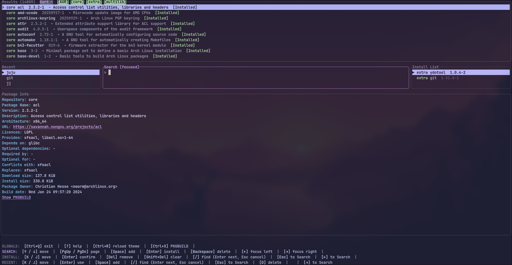
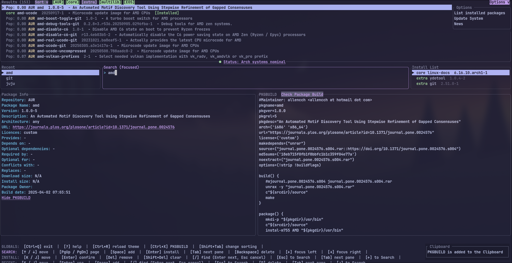

# Pacsea

[](LICENSE)
[](https://www.rust-lang.org/)
[](#)

Fast TUI for searching, inspecting, and queueing pacman/AUR packages written in Rust. Inspired by Omarchy's Package Install Tool.

### PKGBUILD Viewer




- PKGBUILD viewer is now optional and can be toggled with `Ctrl+X` or clicking the "Show PKGBUILD" label in the Package Info panel.
---

## Table of Contents
- [Overview](#overview)
- [Features](#features)
- [Installation](#installation)
  - [Prerequisites](#prerequisites)
  - [Install from AUR](#install-from-aur)
  - [Build from source](#build-from-source)
  - [Run](#run)
- [Usage](#usage)
- [Command-line options](#command-line-options)
- [Keybindings](#keybindings)
- [Configuration (Theme)](#configuration-theme)
- [Data sources and performance](#data-sources-and-performance)
- [Files created](#files-created)
- [Troubleshooting](#troubleshooting)
- [Roadmap](#roadmap)
- [Inspiration and credits](#inspiration-and-credits)
- [License](#license)

## Overview
Pacsea is a keyboard‑first package explorer for Arch Linux. It unifies official repository and AUR search into a single, responsive TUI, with always‑visible panes for results, recent searches, an install list, and a rich Package Info view.

> Inspired by workflows from the Omarchy distro, Pacsea focuses on speed, clarity, and minimal keystrokes.

## Features
- ⚡ Instant, debounced search across official repos and AUR
- 🧭 Three‑pane layout: Results, Recent/Search/Install, Package Info
- 🔎 In‑pane find (/) for Recent and Install panes
- ➕ One‑key queueing (Space) and batch install confirmation
- 🏷️ Repo badges (core/extra/AUR) shown in Results and Install lists
- ⭐ AUR popularity displayed in Results and Install lists
- 🧠 Caching of details and local index for faster subsequent usage
- 📝 Install log written to `install_log.txt`
- 🧪 `--dry-run` mode for safe testing
- 🖱️ Click the URL in Package Info to open it in your browser (uses `xdg-open`)
- 📦 PKGBUILD preview via "Show PKGBUILD" / "Hide PKGBUILD" in Package Info (mouse click; Esc to close)
- 🧠 New sort option: Best matches (relevance) added alongside AUR popularity and alphabetical
- 🔘 Clickable repo filters in Results title: [AUR], [core], [extra], [multilib], [EOS]
- ⌨️ Vim‑style Search modes: toggle Normal/Insert; select with h/l, delete with d
- 🪄 Package Info follows the focused pane (Results/Recent/Install)
- 📋 PKGBUILD: One‑click "Check Package Build" copies the PKGBUILD to clipboard with a configurable suffix
- 🧩 Panels dropdown: quickly hide/show the Recent pane, the Install/Remove pane, and the Keybinds footer; your choices persist in `pacsea.conf`
- ⚙️ Config/Lists dropdown: quick links to open `pacsea.conf`, `install_list.json`, `installed_list.json`, and `recent_searches.json`
- 📋 List installed packages view (Options → "List installed packages")
- 🗑️ Remove List pane for uninstalling packages with confirmation
- ⚠️ Core‑package warning shown when uninstalling core packages
- 🟣 EndeavourOS repos supported (`eos`, `endeavouros`) with an [EOS] filter
- 🔧 System Update dialog (Options → "Update System") for mirrors, pacman, AUR, and cache
- 📰 Arch Linux News popup (Options → "Arch Linux News"): latest items; titles containing "critical" or "require(s) manual intervention" are highlighted in red; Enter opens the link
- 🚀 Startup news check: if there is news dated today (UTC), the News popup opens automatically; otherwise a bottom‑right toast shows "No new News today" for 10 seconds
- 🟢 AUR/Arch status indicator: brief status fetched from `status.archlinux.org` with color cue (operational/incident today)

## Installation
### Prerequisites
- Arch Linux (or derivative) with pacman
- `curl` for web fallbacks and AUR requests
- For AUR installs: one of `paru` or `yay` (auto‑detected)
- Rust toolchain (to build from source)
 - Clipboard support for "Check Package Build": install either `wl-clipboard` (Wayland; provides `wl-copy`) or `xclip` (X11). If neither is installed, Pacsea will show a notice instead of copying.

### Install from AUR
If you already use an AUR helper:

```bash
# Stable release (prebuilt binaries)
paru -S pacsea-bin     # or: yay -S pacsea-bin
```

### Recommended, if you want the newest features
```bash
# Latest development snapshot
paru -S pacsea-git     # or: yay -S pacsea-git
```

Don’t have an AUR helper yet? Install one from the AUR:

```bash
# Common prerequisites
sudo pacman -S --needed base-devel git

# Install paru
git clone https://aur.archlinux.org/paru.git
cd paru && makepkg -si

# …or install yay
git clone https://aur.archlinux.org/yay.git
cd yay && makepkg -si
```

Then install Pacsea:

```bash
paru -S pacsea-bin      # or: yay -S pacsea-bin
# For the -git (latest) package: paru -S pacsea-git
```

### Build from source
```bash
# 1) Install Rust (if needed)
sudo pacman -S rustup && rustup default stable

# 2) Clone and build
git clone https://github.com/Firstp1ck/Pacsea
cd Pacsea
cargo build --release
```

### Run
```bash
# Run the optimized binary
./target/release/Pacsea

# Or run in dev mode
cargo run

# Optional: no installs are performed
./target/release/Pacsea --dry-run
```

Development note:
- When running with `cargo run`, Pacsea looks for `config/pacsea.conf` in the repo first. If not found, it writes a skeleton to `~/.config/pacsea/pacsea.conf` (or `$XDG_CONFIG_HOME/pacsea/pacsea.conf`).

## Usage
1) Start typing to search. With an empty query, Pacsea shows the official index (after the first refresh).
2) Use Up/Down/PageUp/PageDown to navigate results.
3) Press Space to add the selected package to the Install list.
4) Press Enter to confirm installing the selected (Search) or all (Install) packages.
5) Use the Recent pane to re‑run prior queries; Enter loads the query into Search, Space quickly adds the first match.
6) Optional: Left‑click the URL in the Package Info panel to open it in your browser.
7) Optional: Click "Show PKGBUILD" in Package Info to open a side‑by‑side PKGBUILD preview; use the mouse wheel to scroll; press Esc to close.

- Sorting and filters: In the Results title bar, click "Sort ▾" to choose between Pacman‑first or AUR‑popularity‑first ordering. Toggle repo visibility by clicking [AUR], [core], [extra], [multilib].
- Focused details: The bottom Package Info panel shows details for the selection in the currently focused pane (Results, Recent, or Install).

Pacsea prefetches details for the first few results to keep it snappy.

- Tips: Options → "Arch Linux News" to view the latest news; use Up/Down to select and Enter to open. Critical/manual‑intervention items are marked in red.
 - Panels: Use the "Panels ▾" dropdown (top‑right, left of Options) to toggle visibility of the Recent pane, the Install/Remove pane, and the Keybinds footer.

### Installed‑only mode and removal

- Open the Options menu (top‑right) and choose "List installed packages" to toggle an installed‑only view.
- In this mode, the Results show only installed packages and the right pane becomes the "Remove List".
- Space adds the selected package to the Remove List; Enter in the Remove List opens a confirmation dialog to uninstall.
- If any core packages are selected, the dialog shows a warning. In `--dry-run` mode, Pacsea prints the exact command instead of making changes.

### System update options

- Options → "Update System" opens a dialog where you can toggle:
  - Update Arch mirrors (optionally choose a country)
  - Update system packages (sudo pacman -Syu)
  - Update AUR packages (paru/yay)
  - Remove caches (pacman and AUR helper)
- Use Space to toggle items and Enter to run the selected actions in a terminal.

### Install behavior

- Install list entries show their source repository (core/extra or AUR).
- Installs are non‑interactive by default and pass `--noconfirm` to the underlying tools.
- When you confirm install from the Install pane:
  - If at least one AUR package is present, the entire list is installed via your AUR helper (prefers `paru`, falls back to `yay`).
  - Otherwise, all packages are installed via `sudo pacman -S --needed --noconfirm`.
- In `--dry-run` mode, Pacsea prints the exact commands it would run instead of performing changes.

## Command-line options
- `--dry-run` — run Pacsea without performing any installs. Useful for testing and demos.

## Keybindings

| Pane     | Action                         | Keys (defaults)              |
|----------|--------------------------------|------------------------------|
| Global   | Help overlay                   | F1 or ?                      |
| Global   | Switch panes                   | Tab / Shift+Tab, ← / →       |
| Global   | Exit                           | Ctrl+C or configured key     |
| Global   | Reload config/theme            | Ctrl+R                       |
| Global   | Toggle PKGBUILD viewer         | Ctrl+X                       |
| Dialogs  | Confirm / Cancel               | Enter / Esc                  |
| Search   | Move selection                 | ↑ / ↓, PageUp / PageDown     |
| Search   | Add to install                 | Space                        |
| Search   | Install selected               | Enter                        |
| Search   | Toggle Normal/Insert mode      | Esc / i                      |
| Search   | Normal: extend select left/right | h / l                      |
| Search   | Normal: delete selection       | d                            |
| Search   | Normal: clear Recent (focused) | Shift+Del or configured key  |
| Search   | Normal: move list selection    | j / k                        |
| Recent   | Move selection                 | j / k, ↑ / ↓                 |
| Recent   | Use query / Add first match    | Enter / Space                |
| Recent   | Find in pane                   | /, Enter=next, Esc=cancel    |
| Install  | Move selection                 | j / k, ↑ / ↓                 |
| Install  | Confirm install all            | Enter                        |
| Install  | Remove selected / Clear all    | d or Delete / Shift+Delete   |
| Details  | Open URL                       | Ctrl+Shift+left‑click on URL |
| Details  | Show/Hide PKGBUILD             | Mouse left‑click on label    |
| PKGBUILD | Close viewer                   | Esc                          |
| PKGBUILD | Scroll                         | Mouse wheel                  |
| PKGBUILD | Copy to clipboard              | Click "Check Package Build"  |

Press F1 or ? for a full‑screen help overlay with your configured bindings. A compact multi‑line help is also visible at the bottom of Package Info. Mouse: Left‑click the URL in Package Info to open it.

When "List installed packages" is enabled, the right pane becomes the "Remove List"; press Enter there to confirm uninstall.

Note: Esc does not quit the app. It cancels dialogs or navigates between panes, depending on context. Use Ctrl+C or your configured exit key to quit.

## Configuration (Theme, Settings, and Keybindings)

Pacsea supports a configurable color theme and basic app settings via a simple `key = value` config file.

- Locations (first match wins):
  - `~/.config/pacsea/pacsea.conf` (fallback: `$XDG_CONFIG_HOME/pacsea/pacsea.conf`)
  - Development: `config/pacsea.conf` in the repo is preferred during development

- First‑run generation:
  - If no config exists, Pacsea creates `~/.config/pacsea/pacsea.conf` (fallback: `$XDG_CONFIG_HOME/pacsea/pacsea.conf`).
  - It copies your repo `config/pacsea.conf` if present; otherwise it writes a complete default theme.
  - On startup, Pacsea appends any missing known settings keys to your config (non‑destructive; comments preserved).

- Live reload:
  - Press `Ctrl+R` to reload the config while the app is running.

- Validation and diagnostics:
  - The config loader reports precise issues with line numbers, for example:
    - `- Unknown key 'backgrond_base' on line 15 (did you mean 'background_base'?)`
    - `- Missing required keys: background_base`
    - `- Missing '=' on line 7`
    - `- Missing key before '=' on line 12`
    - `- Duplicate key 'text_primary' on line 22`
    - `- Invalid color for 'accent_heading' on line 18 (use #RRGGBB or R,G,B)`

- Key naming:
  - Preferred comprehensive names are documented below.

- Application settings and keybindings (in the same `pacsea.conf`):
  - `layout_left_pct`, `layout_center_pct`, `layout_right_pct` — integers that must sum to 100; control the middle row pane widths. Defaults: 20/60/20.
  - `app_dry_run_default` — `true`/`false`; sets default dry‑run mode at startup. Overridden by the `--dry-run` flag.
  - Visibility: `show_recent_pane`, `show_install_pane`, `show_keybinds_footer` — `true`/`false`; control initial visibility of the Recent pane, Install/Remove pane, and the Details keybinds footer.
  - Clipboard: `clipboard_suffix` — text appended when copying PKGBUILD to clipboard. Default: "Check PKGBUILD and source for suspicious and malicious activities".
  - Keybindings (one chord per action; modifiers can be `SUPER`, `CTRL`, `SHIFT`, `ALT`). Examples:
    - Global: `keybind_help`, `keybind_reload_theme`, `keybind_exit`, `keybind_show_pkgbuild`, `keybind_pane_next`, `keybind_pane_left`, `keybind_pane_right`, `keybind_change_sort`
    - Search: `keybind_search_move_up`, `keybind_search_move_down`, `keybind_search_page_up`, `keybind_search_page_down`, `keybind_search_add`, `keybind_search_install`, `keybind_search_focus_left`, `keybind_search_focus_right`, `keybind_search_backspace`
    - Search (Normal mode): `keybind_search_normal_toggle`, `keybind_search_normal_insert`, `keybind_search_normal_select_left`, `keybind_search_normal_select_right`, `keybind_search_normal_delete`
    - Recent: `keybind_recent_move_up`, `keybind_recent_move_down`, `keybind_recent_find`, `keybind_recent_use`, `keybind_recent_add`, `keybind_recent_to_search`, `keybind_recent_focus_right`
    - Install: `keybind_install_move_up`, `keybind_install_move_down`, `keybind_install_confirm`, `keybind_install_remove`, `keybind_install_clear`, `keybind_install_find`, `keybind_install_to_search`, `keybind_install_focus_left`

Example (hex and decimal):

```ini
# Background layers
background_base = #1e1e2e
background_mantle = #181825
background_crust = #11111b

# Component surfaces
surface_level1 = #45475a
surface_level2 = #585b70

# Overlays (borders/lines)
overlay_primary = #7f849c
overlay_secondary = #9399b2

# Text
text_primary = #cdd6f4
text_secondary = 166,173,200  # decimal R,G,B also supported
text_tertiary = #bac2de

# Accents
accent_interactive = #74c7ec
accent_heading = #cba6f7
accent_emphasis = #b4befe

# Semantics
semantic_success = #a6e3a1
semantic_warning = #f9e2af
semantic_error   = #f38ba8

# Application settings
layout_left_pct = 20
layout_center_pct = 60
layout_right_pct = 20
app_dry_run_default = false
sort_mode = best_matches

# Panels visibility
show_recent_pane = true
show_install_pane = true
show_keybinds_footer = true

# Clipboard
clipboard_suffix = Check PKGBUILD and source for suspicious and malicious activities
```

An optional commented “Light” theme block is included in the generated config for quick switching.

## Data sources and performance
- Official repositories
  - Local pacman is preferred for speed: `pacman -Sl` (names) + batched `pacman -Si` (details)
  - Falls back to archlinux.org JSON if needed
  - A background refresh runs at startup; the index is enriched on‑demand as you browse
  - EndeavourOS repos (`eos`, `endeavouros`) are included when present; the unified [EOS] filter controls their visibility
- AUR
  - AUR RPC v5 is used for search and details
  - AUR popularity is fetched from RPC and shown when available
 - PKGBUILD preview
   - AUR packages: `https://aur.archlinux.org/cgit/aur.git/plain/PKGBUILD?h=<name>`
   - Official packages: Arch GitLab raw `PKGBUILD` (tries `main`, falls back to `master`)

## Files created

| File                   | Purpose                                                            |
|------------------------|--------------------------------------------------------------------|
| `official_index.json`  | Local cache of official packages (repo/name/arch/description) — lists dir |
| `details_cache.json`   | Package name → detailed metadata used in Package Info — lists dir |
| `recent_searches.json` | Recent queries (deduped, MRU) — lists dir                     |
| `install_list.json`    | Persisted install queue — lists dir                            |
| `install_log.txt`      | Timestamped record of packages you initiated installs for — logs dir |
| `remove_log.txt`       | Names of removed packages (one per line) — logs dir                 |

XDG locations (env overrides respected):
- Config: `~/.config/pacsea/pacsea.conf` (fallback `$XDG_CONFIG_HOME/pacsea/pacsea.conf`)
- Logs: `~/.config/pacsea/logs/`
- Lists: `~/.config/pacsea/lists/`
- Data: `$XDG_DATA_HOME/pacsea/`

## Troubleshooting
- Official details show empty fields
  - Ensure pacman is available and that `LC_ALL=C pacman -Si <pkg>` prints keys like “Name”, “Description”. Pacsea enforces `LC_ALL=C` for its pacman calls.
- AUR search errors
  - Check network connectivity (AUR RPC is online).
- Installs don’t start
  - Pacsea opens a terminal to run commands. It tries common emulators in this order (if found on PATH): `alacritty`, `kitty`, `xterm`, `gnome-terminal`, `konsole`, `xfce4-terminal`, `tilix`, `mate-terminal`. If none are found, it falls back to `bash`. Ensure at least one is installed.
  - Official installs use `sudo pacman`; make sure you can authenticate with sudo in a terminal.

## Roadmap

 ### Vote for next Feature:
- [Vote for Feature](https://github.com/Firstp1ck/Pacsea/discussions/4)

### Implemented
- [x] Theme customization system (themes, color palettes, glyph styles; adaptive terminal colors)
- [x] Prebuilt binaries / packaging (Arch User Repository)
 - [x] XDG‑aware configuration with persistent settings (config subdirectories: logs/lists; basic app settings)
- [x] Customizable keybindings and context help overlay
- [x] Richer package info: PKGBUILD preview
- [x] Repo filters in Results (AUR/core/extra/multilib/EOS)
- [x] Sort modes: Alphabetical (Pacman‑first), AUR popularity, Best matches
- [x] PKGBUILD copy button with configurable suffix
- [x] AUR popularity shown in Results and Install lists
- [x] Vim‑style Search normal/insert modes
- [x] Installed‑only mode (Options → List installed packages)
- [x] Remove List pane and uninstall confirmation flow
- [x] EndeavourOS repos support (`eos`, `endeavouros`) with [EOS] filter
- [x] System Update dialog (mirrors, pacman, AUR, cache)
- [x] Arch Linux News popup with critical/manual‑intervention highlighting
- [x] Startup news check
- [x] AUR/Arch status indicator (operational/incident‑today cue)
- [x] Toggle visibility of panes/sections

### Not implemented
- [ ] Rollback/downgrade flows
- [ ] Search modes: contains / starts‑with / regex
- [ ] Quick actions: refresh, clear cache, toggle views
- [ ] Adjustable pane proportions (resizable three‑pane layout)
- [ ] Multi‑select (checkbox‑style) for bulk actions
- [ ] Dependency tree and conflict insights
- [ ] Package statistics (sizes, install dates, update frequency)
- [ ] Settings persistence across sessions
- [ ] Smarter caching and performance (intelligent prefetch, async enrichment, offline mode)
- [ ] Progress indicators for long tasks
- [ ] Improved paru/yay workflows
- [ ] Export/import package lists (backup/share)
- [ ] Richer package info (dependency visualization)
- [ ] Batch operations (filter installed vs available, apply to selection)
- [ ] Multiple profiles for different workflows
- [ ] Background operations (parallel/async installs)
- [ ] Pacman hooks/post‑install integration
- [ ] Internationalization (multi‑language)
- [ ] Responsive layouts for small terminals
- [ ] Screen reader/accessibility support
- [ ] Automatic update checks
- [ ] Selective updates, pinning/version policies
- [ ] System maintenance helpers
- [ ] Signature verification indicators
- [ ] Enhanced dry‑run with impact analysis
- [ ] Sorting: name/date/size (beyond current repo/popularity modes)

## Inspiration and credits
- Omarchy Distro — UX/workflow inspiration
- ratatui, crossterm — great TUI foundations
- Arch Linux, AUR — data sources and tooling

## License
This project is licensed under the MIT License. See [LICENSE](LICENSE).
