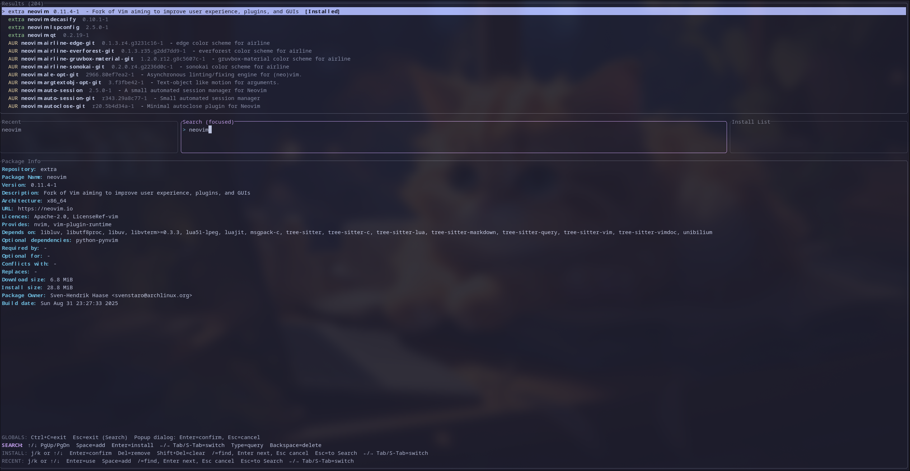

# Pacsea

[](LICENSE)
[](https://www.rust-lang.org/)
[](#)

Fast TUI for searching, inspecting, and queueing pacman/AUR packages written in Rust. Inspired by Omarchy's Package Install Tool.



---

## Table of Contents
- [Overview](#overview)
- [Features](#features)
- [Installation](#installation)
  - [Prerequisites](#prerequisites)
  - [Install from AUR](#install-from-aur)
  - [Build from source](#build-from-source)
  - [Run](#run)
- [Usage](#usage)
- [Command-line options](#command-line-options)
- [Keybindings](#keybindings)
- [Configuration (Theme)](#configuration-theme)
- [Data sources and performance](#data-sources-and-performance)
- [Files created](#files-created)
- [Troubleshooting](#troubleshooting)
- [Roadmap](#roadmap)
- [Inspiration and credits](#inspiration-and-credits)
- [License](#license)

## Overview
Pacsea is a keyboard‑first package explorer for Arch Linux. It unifies official repository and AUR search into a single, responsive TUI, with always‑visible panes for results, recent searches, an install list, and a rich Package Info view.

> Inspired by workflows from the Omarchy distro, Pacsea focuses on speed, clarity, and minimal keystrokes.

## Features
- ⚡ Instant, debounced search across official repos and AUR
- 🧭 Three‑pane layout: Results, Recent/Search/Install, Package Info
- 🔎 In‑pane find (/) for Recent and Install panes
- ➕ One‑key queueing (Space) and batch install confirmation
- 🧠 Caching of details and local index for faster subsequent usage
- 📝 Install log written to `install_log.txt`
- 🧪 `--dry-run` mode for safe testing
- 🖱️ Click the URL in Package Info to open it in your browser (uses `xdg-open`)

## Installation
### Prerequisites
- Arch Linux (or derivative) with pacman
- `curl` for web fallbacks and AUR requests
- For AUR installs: one of `paru` or `yay` (auto‑detected)
- Rust toolchain (to build from source)

### Install from AUR
If you already use an AUR helper:

```bash
# Stable release (tagged)
paru -S pacsea-bin     # or: yay -S pacsea-bin

# Latest development (from main)
paru -S pacsea-git # or: yay -S pacsea-git
```

Don’t have an AUR helper yet? Install one from the AUR:

```bash
# Common prerequisites
sudo pacman -S --needed base-devel git

# Install paru
git clone https://aur.archlinux.org/paru.git
cd paru && makepkg -si

# …or install yay
git clone https://aur.archlinux.org/yay.git
cd yay && makepkg -si
```

Then install Pacsea:

```bash
paru -S pacsea      # or: yay -S pacsea
# For the -git (latest) package: paru -S pacsea-git
```

### Build from source
```bash
# 1) Install Rust (if needed)
sudo pacman -S rustup && rustup default stable

# 2) Clone and build
git clone https://github.com/Firstp1ck/Pacsea
cd Pacsea
cargo build --release
```

### Run
```bash
# Run the optimized binary
./target/release/Pacsea

# Or run in dev mode
cargo run

# Optional: no installs are performed
./target/release/Pacsea --dry-run
```

## Usage
1) Start typing to search. With an empty query, Pacsea shows the official index (after the first refresh).
2) Use Up/Down/PageUp/PageDown to navigate results.
3) Press Space to add the selected package to the Install list.
4) Press Enter to confirm installing the selected (Search) or all (Install) packages.
5) Use the Recent pane to re‑run prior queries; Enter loads the query into Search, Space quickly adds the first match.
6) Optional: Left‑click the URL in the Package Info panel to open it in your browser.

The bottom Package Info panel displays rich metadata for the selected item; Pacsea prefetches details for the first few results to keep it snappy.

## Command-line options
- `--dry-run` — run Pacsea without performing any installs. Useful for testing and demos.

## Keybindings

| Pane     | Action                         | Keys (defaults)              |
|----------|--------------------------------|------------------------------|
| Global   | Help overlay                   | F1 or ?                      |
| Global   | Switch panes                   | Tab / Shift+Tab, ← / →       |
| Global   | Exit                           | Ctrl+C (or configured key)   |
| Global   | Reload config/theme            | Ctrl+R                       |
| Dialogs  | Confirm / Cancel               | Enter / Esc                  |
| Search   | Move selection                 | ↑ / ↓, PageUp / PageDown     |
| Search   | Add to install                 | Space                        |
| Search   | Install selected               | Enter                        |
| Recent   | Move selection                 | j / k, ↑ / ↓                 |
| Recent   | Use query / Add first match    | Enter / Space                |
| Recent   | Find in pane                   | /, Enter=next, Esc=cancel    |
| Install  | Move selection                 | j / k, ↑ / ↓                 |
| Install  | Confirm install all            | Enter                        |
| Install  | Remove selected / Clear all    | Delete / Shift+Delete        |

Press F1 or ? for a full‑screen help overlay with your configured bindings. A compact multi‑line help is also visible at the bottom of Package Info. Mouse: Left‑click the URL in Package Info to open it.

Note: Esc does not quit the app. It cancels dialogs or navigates between panes, depending on context. Use Ctrl+C or your configured exit key to quit.

## Configuration (Theme, Settings, and Keybindings)

Pacsea supports a configurable color theme and basic app settings via a simple `key = value` config file.

- Locations (first match wins):
  - `$XDG_CONFIG_HOME/pacsea/pacsea.conf` (fallback: `~/.config/pacsea/pacsea.conf`)
  - Development: `config/pacsea.conf` in the repo is preferred during development

- First‑run generation:
  - If no config exists, Pacsea creates `$XDG_CONFIG_HOME/pacsea/pacsea.conf` (fallback: `~/.config/pacsea/pacsea.conf`).
  - It copies your repo `config/pacsea.conf` if present; otherwise it writes a complete default theme.

- Live reload:
  - Press `Ctrl+R` to reload the config while the app is running.

- Validation and diagnostics:
  - The config loader reports precise issues with line numbers, for example:
    - `- Unknown key 'backgrond_base' on line 15 (did you mean 'background_base'?)`
    - `- Missing required keys: background_base`
    - `- Missing '=' on line 7`
    - `- Missing key before '=' on line 12`
    - `- Duplicate key 'text_primary' on line 22`
    - `- Invalid color for 'accent_heading' on line 18 (use #RRGGBB or R,G,B)`

- Key naming:
  - Preferred comprehensive names are documented below.

- Application settings and keybindings (in the same `pacsea.conf`):
  - `layout_left_pct`, `layout_center_pct`, `layout_right_pct` — integers that must sum to 100; control the middle row pane widths. Defaults: 20/60/20.
  - `app_dry_run_default` — `true`/`false`; sets default dry‑run mode at startup. Overridden by the `--dry-run` flag.
  - Keybindings (one chord per action; modifiers can be `SUPER`, `CTRL`, `SHIFT`, `ALT`). Examples:
    - Global: `keybind_help`, `keybind_reload_theme`, `keybind_exit`, `keybind_pane_next`, `keybind_pane_prev`, `keybind_pane_left`, `keybind_pane_right`
    - Search: `keybind_search_move_up`, `keybind_search_move_down`, `keybind_search_page_up`, `keybind_search_page_down`, `keybind_search_add`, `keybind_search_install`, `keybind_search_focus_left`, `keybind_search_focus_right`, `keybind_search_backspace`
    - Recent: `keybind_recent_move_up`, `keybind_recent_move_down`, `keybind_recent_find`, `keybind_recent_use`, `keybind_recent_add`, `keybind_recent_to_search`, `keybind_recent_focus_right`
    - Install: `keybind_install_move_up`, `keybind_install_move_down`, `keybind_install_confirm`, `keybind_install_remove`, `keybind_install_clear`, `keybind_install_find`, `keybind_install_to_search`, `keybind_install_focus_left`

Example (hex and decimal):

```ini
# Background layers
background_base = #1e1e2e
background_mantle = #181825
background_crust = #11111b

# Text
text_primary = #cdd6f4
text_secondary = 166,173,200  # decimal R,G,B also supported
text_tertiary = #bac2de

# Accents
accent_interactive = #74c7ec
accent_heading = #cba6f7
accent_emphasis = #b4befe

# Semantics
semantic_success = #a6e3a1
semantic_warning = #f9e2af
semantic_error   = #f38ba8

# Application settings
layout_left_pct = 20
layout_center_pct = 60
layout_right_pct = 20
app_dry_run_default = false
```

An optional commented “Light” theme block is included in the generated config for quick switching.

## Data sources and performance
- Official repositories
  - Local pacman is preferred for speed: `pacman -Sl` (names) + batched `pacman -Si` (details)
  - Falls back to archlinux.org JSON if needed
  - A background refresh runs at startup; the index is enriched on‑demand as you browse
- AUR
  - AUR RPC v5 is used for search and details

## Files created

| File                   | Purpose                                                            |
|------------------------|--------------------------------------------------------------------|
| `official_index.json`  | Local cache of official packages (repo/name/arch/description) — XDG cache dir |
| `details_cache.json`   | Package name → detailed metadata used in Package Info — XDG cache dir |
| `recent_searches.json` | Recent queries (deduped, MRU) — XDG state dir                     |
| `install_list.json`    | Persisted install queue — XDG state dir                            |
| `install_log.txt`      | Timestamped record of packages you initiated installs for — XDG state dir |

XDG locations (env overrides respected):
- Config: `$XDG_CONFIG_HOME/pacsea/pacsea.conf` (fallback `~/.config/pacsea/pacsea.conf`)
- Cache: `$XDG_CACHE_HOME/pacsea/`
- State: `$XDG_STATE_HOME/pacsea/`
- Data: `$XDG_DATA_HOME/pacsea/`

## Troubleshooting
- Official details show empty fields
  - Ensure pacman is available and that `LC_ALL=C pacman -Si <pkg>` prints keys like “Name”, “Description”. Pacsea enforces `LC_ALL=C` for its pacman calls.
- AUR search errors
  - Check network connectivity (AUR RPC is online).
- Installs don’t start
  - Pacsea opens a terminal to run commands. It tries common emulators in this order (if found on PATH): `alacritty`, `kitty`, `xterm`, `gnome-terminal`, `konsole`, `xfce4-terminal`, `tilix`, `mate-terminal`. If none are found, it falls back to `bash`. Ensure at least one is installed.
  - Official installs use `sudo pacman`; make sure you can authenticate with sudo in a terminal.

## Roadmap

### Implemented
- [x] Theme customization system (themes, color palettes, glyph styles; adaptive terminal colors)
- [x] Prebuilt binaries / packaging (Arch User Repository)
- [x] XDG‑compliant configuration with persistent settings (config/cache/state dirs; basic app settings)
- [x] Customizable keybindings and context help overlay

### Not implemented
- [ ] Search modes: contains / starts‑with / regex
- [ ] Scope filtering: official vs AUR
- [ ] Sorting: name, popularity, date, size
- [ ] Quick actions: refresh, clear cache, toggle views
- [ ] Adjustable pane proportions (resizable three‑pane layout)
- [ ] Toggle visibility of panes/sections
- [ ] Multi‑select (checkbox‑style) for bulk actions
- [ ] Selection persistence across searches
- [ ] Dependency tree and conflict insights
- [ ] Package statistics (sizes, install dates, update frequency)
- [ ] Arch news integration in context
- [ ] Settings persistence across sessions
- [ ] Smarter caching and performance (intelligent prefetch, async enrichment, offline mode)
- [ ] Progress indicators for long tasks
- [ ] Improved paru/yay workflows
- [ ] Export/import package lists (backup/share)
- [ ] Richer package info (PKGBUILD preview, dependency visualization)
- [ ] Batch operations (filter installed vs available, apply to selection)
- [ ] Multiple profiles for different workflows
- [ ] Background operations (parallel/async installs)
- [ ] Pacman hooks/post‑install integration
- [ ] Internationalization (multi‑language)
- [ ] Responsive layouts for small terminals
- [ ] Screen reader/accessibility support
- [ ] Automatic update checks
- [ ] Selective updates, pinning/version policies
- [ ] System maintenance helpers
- [ ] Signature verification indicators
- [ ] Rollback/downgrade flows
- [ ] Enhanced dry‑run with impact analysis

## Inspiration and credits
- Omarchy Distro — UX/workflow inspiration
- ratatui, crossterm — great TUI foundations
- Arch Linux, AUR — data sources and tooling

## License
This project is licensed under the MIT License. See [LICENSE](LICENSE).
