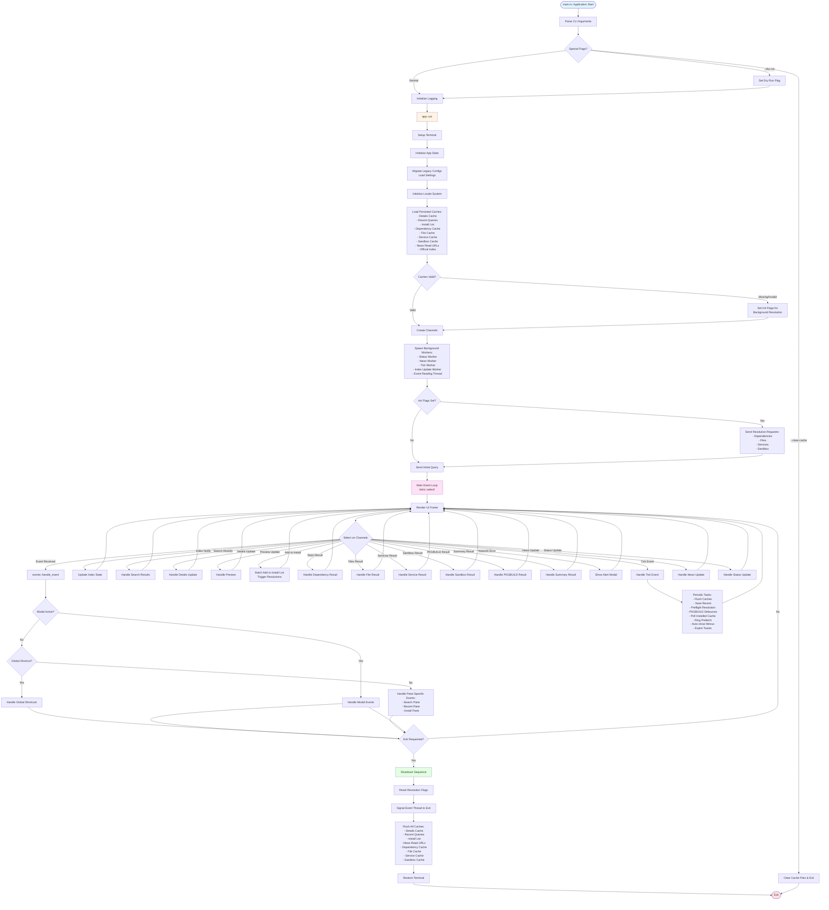

# Pacsea Application Control Flow Diagram

This diagram shows the complete control flow of the Pacsea TUI application, from startup to shutdown.

## Key Components

### 1. Initialization Phase
- **CLI Argument Parsing**: Handles command-line flags (--dry-run, --clear-cache, etc.)
- **Logging Setup**: Initializes tracing logger to file
- **Terminal Setup**: Configures terminal for TUI mode
- **State Initialization**: Loads settings, caches, locale system
- **Channel Creation**: Sets up async communication channels
- **Worker Spawning**: Launches background workers for async operations

### 2. Main Event Loop
The application uses `tokio::select!` to concurrently handle multiple async channels:
- **User Input**: Keyboard and mouse events
- **Search Results**: Package search results from AUR/official repos
- **Details Updates**: Package information updates
- **Analysis Results**: Dependency, file, service, and sandbox analysis
- **PKGBUILD Content**: Package build file content
- **Preflight Summary**: Installation preflight analysis results
- **News/Status**: Arch Linux news and status updates
- **Tick Events**: Periodic background tasks

### 3. Event Handling
Events are processed in priority order:
1. **Modal Interactions**: Active modal dialogs (handled first)
2. **Global Shortcuts**: Application-wide shortcuts (help, exit, theme reload)
3. **Pane-Specific Events**: Search, Recent, and Install pane interactions

### 4. Background Workers
Asynchronous workers handle:
- **Search Worker**: AUR and official repository package search
- **Details Worker**: Package information retrieval
- **Dependency Worker**: Dependency resolution and analysis
- **File Worker**: File system impact analysis
- **Service Worker**: Systemd service impact analysis
- **Sandbox Worker**: AUR package sandbox analysis
- **News Worker**: Arch Linux news fetching
- **Status Worker**: Arch status page monitoring
- **Index Worker**: Official package index updates

### 5. Tick Handler (Periodic Tasks)
The tick handler performs periodic maintenance:
- **Cache Persistence**: Debounced writes of dirty caches
- **Preflight Resolution**: Processes queued preflight analysis requests
- **PKGBUILD Debouncing**: Manages PKGBUILD reload requests
- **Installed Cache Polling**: Refreshes installed package cache after installs/removals
- **Ring Prefetch**: Prefetches details for packages around selection
- **UI State Cleanup**: Auto-closes menus and expires toast messages

### 6. Shutdown Sequence
Graceful shutdown process:
- Reset all resolution flags
- Signal background threads to exit
- Flush all pending cache writes
- Restore terminal to original state

## Architecture Notes

- **Async Architecture**: Uses Tokio for async runtime with channels for communication
- **Event-Driven**: Main loop responds to events from multiple sources
- **Background Processing**: Heavy I/O operations run in background workers
- **State Management**: Centralized `AppState` holds all application state
- **Cache Strategy**: Multiple caches with signature-based validation
- **Debouncing**: Used for cache writes and PKGBUILD reloads to reduce I/O

## Converting to Image

To convert this Mermaid diagram to a PNG image, you can use:

1. **Mermaid CLI**: `mmdc -i ControlFlow_Diagram.md -o ControlFlow_Diagram.png`
2. **Online Tools**: Paste the mermaid code block into https://mermaid.live/
3. **VS Code Extension**: Use the "Markdown Preview Mermaid Support" extension
4. **GitHub/GitLab**: The diagram will render automatically in markdown files

