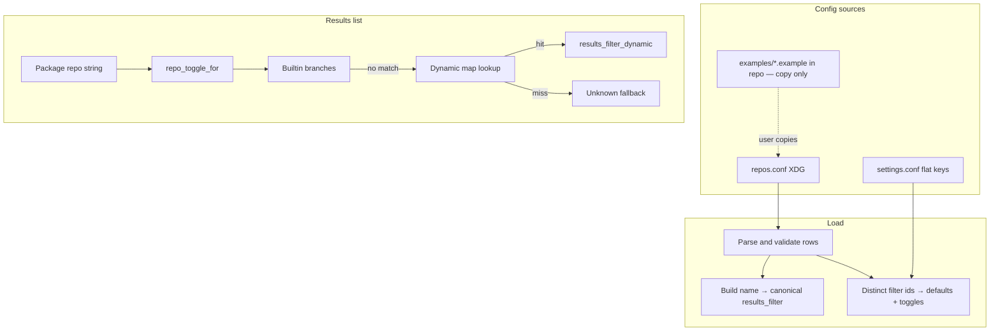

# Implementation plan: custom / third-party repositories (Pacsea)

**Goal:** Let users define extra official-style `pacman` repositories in Pacsea—generically, via `repos.conf`—with safe, idempotent **apply** matching the existing privilege model (**Phase 3**: managed drop-in, active-marker `Include`, optional `mirrorlist_url`+curl, `key_server`, `pacman-key`, final **`pacman -Sy --noconfirm`**). Vendor-specific blobs (Chaotic-AUR, EndeavourOS, etc.) live only in **documentation / example files** users can copy; the binary does not ship a merged preset catalog.

**Tracking:** GitHub issue [#132](https://github.com/Firstp1ck/Pacsea/issues/132) and `dev/IMPROVEMENTS/FEATURE_PRIORITY.md` (Tier 4+: extra repos).

## Implementation status (in-tree)

| Phase | Scope | Status |
|-------|--------|--------|
| **1** | `repos.conf` TOML, paths, validation, **`results_filter` → `repo_toggle_for`**, flat `results_filter_show_<token>` in `settings.conf`, config menu opens `repos.conf` | **Done** |
| **2** | Read-only **Repositories** modal (Options menu), `pacman.conf` scan + shallow `Include`, `pacman-key` trust hint, i18n, tests | **Done** |
| **3** | Privileged apply: managed drop-in, active-line marker detection, `mirrorlist_url`+curl, `key_server`, final `pacman -Sy --noconfirm`, **`PasswordPurpose::RepoApply`**, preflight + `ExecutorRequest::Update`, **`dry_run`** | **Done** |
| **4** | Title-bar toggles for all dynamic filter ids, polish, issue #132 closure | **Not started** |

Reference implementations: `src/logic/repos/` (`config.rs`, `pacman_conf.rs`, `modal_data.rs`, **`apply_plan.rs`**), `src/state/modal.rs` (`Modal::Repositories`, **`PasswordPurpose::RepoApply`**), `src/events/modals/repositories.rs`, `src/ui/modals/misc.rs` (`render_repositories`), `config/examples/repos.conf.example`.

---

## User flow (short)

1. **Options** → **Repositories** — Each `[[repo]]` from `repos.conf` merged with live `/etc/pacman.conf` (and shallow includes) plus optional keyring trust column. **Enter** runs **Apply** for the selected row: it rebuilds the managed drop-in for all enabled rows that have `server`, local `mirrorlist`, or `http`/`https` `mirrorlist_url` (URLs are fetched with **curl** first), optional **`pacman-key`** steps (with **`key_server`** when set), marker **`Include`** append when no **active** begin line exists, then **`pacman -Sy --noconfirm`**. Preflight → password (if needed) → privileged commands. **Setup / Remove / “Apply all”** remain Phase 4+.
2. **Config menu** — `repos.conf` is listed **with** `settings.conf`, `theme.conf`, and `keybinds.conf` (fourth row; numeric `4` where applicable).
3. **Add / define repos** — Edit **`repos.conf`** (TOML). Copy rows from **`config/examples/repos.conf.example`** in the Pacsea repo (or upstream docs); there is **no** `preset = "…"` merge—`preset` is **rejected** at parse time so behavior stays explicit and user-controlled.
4. **Results filters** — Hiding packages from third-party repos uses **`results_filter`** in each row plus **`results_filter_show_<canonical_token>`** lines in **`settings.conf`** (see [`canonical_results_filter_key`](../../src/logic/repos/config.rs)); this is separate from whether a repo is enabled in `pacman.conf`.

**Read-only vs apply:** Phase 3 **Apply** writes `/etc/pacman.d/pacsea-repos.conf` and may append a marker-wrapped **`Include =`** block to `/etc/pacman.conf` once. Commands respect global **`dry_run`** (same path as system update). The **`enabled`** field omits rows from the managed drop-in when `enabled = false`.

---

## Relation to the current codebase

| Area | Where it lives | Notes |
|------|----------------|--------|
| Split config | `src/theme/paths.rs` | `resolve_repos_config_path()` matches other configs. |
| `repos` domain | `src/logic/repos/` | Parse/validate, pacman scan, modal row builder, re-exports. |
| Modal | `src/state/modal.rs`, `src/events/modals/repositories.rs`, `src/ui/modals/` | `Modal::Repositories { rows, selected, scroll, … }`. |
| Options menu | `src/ui/results/dropdowns.rs`, `src/events/global.rs`, `src/events/mouse/menus.rs` | **Repositories** after TUI Optional Deps; numeric indices documented in `handle_options_menu_numeric`. |
| Privilege / exec | `src/logic/privilege.rs`, `src/install/executor.rs`, `src/logic/repos/apply_plan.rs` | Apply uses `build_privilege_command`; `PasswordPurpose::RepoApply`; execution reuses **`ExecutorRequest::Update`** with command list from **`build_repo_apply_bundle`**. |
| Results visibility | `src/logic/distro.rs` (`repo_toggle_for`) | Builtins first; then `repo_results_filter_by_name` + `results_filter_dynamic`. |
| Settings | `src/theme/settings/parse_settings.rs`, `src/theme/types.rs` | Dynamic keys: prefix `results_filter_show_`; canonical token from `repos.conf` via `canonical_results_filter_key`. |
| Examples | `config/examples/repos.conf.example`, `config/repos.conf` | Shipped **examples** and minimal starter—not an in-tree preset merge. |

---

## Configuration: `repos.conf` (user scope)

**Path:** `$XDG_CONFIG_HOME/pacsea/repos.conf` or `~/.config/pacsea/repos.conf`.

### TOML shape (implemented)

```toml
# Full [[repo]] rows only — `preset` is not supported (rejected).

[[repo]]
id = "my-vendor"              # optional; reserved for future UI/apply
enabled = true                 # optional; false = omitted from managed drop-in on Apply
name = "vendor"                # pacman [repo] section name (required)
results_filter = "vendor"      # required; drives results_toggle + settings key

# Apply (Phase 3): set server and/or mirrorlist on rows you want in the managed drop-in
# server = "https://..."
# sig_level = "Required DatabaseOptional"
# key_id = "..."   # ≥8 hex digits → pacman-key --recv-keys / --lsign-key (distinct per fingerprint)
# key_server = "..."  # optional; passed as --keyserver on --recv-keys (first non-empty per fingerprint)
# mirrorlist = "/etc/pacman.d/..."
# mirrorlist_url = "https://..."  # optional; privileged curl to /etc/pacman.d/pacsea-mirror-<slug>-<hash>.list (needs curl)
```

**Design notes:**

- **`results_filter`:** Free-form label; canonical key for `settings.conf` is from `canonical_results_filter_key` (non-alphanumeric → `_`, lowercase). Example: `vendor-aur` → `results_filter_show_vendor_aur`.
- **`repo_toggle_for`:** After hardcoded branches, normalize repo name, look up dynamic map, then `results_filter_dynamic.get(canonical).copied().unwrap_or(true)` (default visible).
- **`preset`:** Intentionally unsupported—avoids maintaining vendor-specific defaults inside the binary; users copy from `config/examples/repos.conf.example` or official install instructions.

---

## Examples (reference only — not merged at runtime)

Maintain **human-oriented** samples under **`config/examples/repos.conf.example`** (third-party server lines, keys, comments). Users (or docs) copy rows into their own `repos.conf`. Updates to examples are **documentation / packaging**, not a runtime catalog.

---

## System mutations (Phase 3 — apply module)

**Implemented** in `src/logic/repos/apply_plan.rs` (planning + privileged shell command strings):

1. Parse user `repos.conf` (no preset merge) when the user confirms Apply.
2. Read main `/etc/pacman.conf` text: append the managed block only when no **active** (uncommented) line equals the begin marker (`# === pacsea managed begin` only in comments does not count).
3. Plan steps (in order): optional **`mirrorlist_url`** downloads via privileged **curl**; for each distinct fingerprint, `pacman-key --recv-keys` (with `--keyserver` when configured) and `--lsign-key`; write full drop-in via `printf` + `tee`; append marker + `Include` when needed; **`pacman -Sy --noconfirm`**.
4. **Per-row gate:** the selected row must be apply-eligible (`server`, `mirrorlist`, or `http`/`https` `mirrorlist_url`, `enabled != false`, `name`); the drop-in still regenerates from **all** eligible rows.

**Conflicts:** if both `mirrorlist` and `mirrorlist_url` are set (or `server` and `mirrorlist_url`), the URL is skipped with a preflight **Note** line; local `mirrorlist` / `server` wins.

**Strategy (unchanged):** single managed **`Include`** drop-in under `/etc/pacman.d/` so the main `pacman.conf` edit stays one marker-delimited append.

---

## TUI: Repositories modal

**Phase 2 (shipped):** Scrollable list; columns for repo name, `results_filter`, pacman section state (active / commented / absent), key trust when `key_id` is set; warnings from include/missing files; Esc closes.

**Phase 3 (shipped):** **Enter** builds the apply bundle (curl fetches, keys, drop-in, optional main-config append, `pacman -Sy`), preflight log lines, then the same privilege flow as system update (`PasswordPurpose::RepoApply`, `PreflightExec` → `ExecutorRequest::Update`). Footer / i18n under `app.modals.repositories.*` including **`apply.*`**.

**Phase 4:** Optional **Setup**, **Remove**, **Refresh key**, **Open config**; broader toasts and help overlay updates.

Patterns: `src/events/modals/optional_deps.rs`, `src/events/modals/repositories.rs`.

---

## Testing (per `AGENTS.md`)

- **Unit:** TOML validation, `pacman.conf` fixtures, modal merge tests in `logic/repos`.
- **Integration:** Pure logic + tempdirs; no real `/etc` in CI.
- **Dry-run (Phase 3):** Apply goes through the same executor path as system update; no mutating PTY exec when `dry_run == true`.

---

## i18n

Modal and options strings under `app.modals.repositories.*` (including **`apply.*`** for Apply), `app.results.options_menu.repositories`, locales in `config/locales/`.

---

## Platform

Linux / Arch-centric; align with existing `pacman` gating if extended to non-Arch.

---

## Phased delivery (roadmap)


### Config load and results filtering (current model)



### Apply repo changes (Phase 3 — implemented)

```mermaid
sequenceDiagram
  participant U as User TUI
  participant M as Repositories modal
  participant A as apply_plan
  participant P as Privilege executor
  participant FS as /etc pacman.d
  participant PK as pacman-key
  participant C as curl
  U->>M: Enter (selected row apply-eligible)
  M->>A: build_repo_apply_bundle repos.conf + pacman.conf text
  A-->>M: summary_lines + privileged commands
  M->>M: Preflight + password if needed (RepoApply)
  alt dry_run
    P-->>M: Log / simulate only
  else apply
    M->>P: ExecutorRequest::Update command chain
    P->>C: mirrorlist_url fetch to pacsea-mirror path
    P->>PK: recv-keys keyserver optional lsign-key
    P->>FS: tee pacsea-repos.conf; append Include if no active marker
    P->>FS: pacman -Sy noconfirm
    P-->>M: Success or error
  end
```

---

## Decisions (record)

| Topic | Decision |
|-------|----------|
| Managed drop-in vs inline | Prefer single **`Include`** drop-in under `/etc/pacman.d/` for Pacsea-managed repos. |
| Results filters | Each **`[[repo]]`** has **`results_filter`**; settings use **`results_filter_show_<canonical>`**; `repo_toggle_for` uses name → canonical map + dynamic map. |
| Presets | **No in-tree preset catalog.** **`preset` key rejected.** Examples live in **`config/examples/repos.conf.example`**. |
| Repo ordering in drop-in | File order in `repos.conf` defines drop-in order; document per-upstream if ordering matters relative to `[core]`. |
| Apply UX scope | **Per-row Enter** validates selection; regenerates drop-in for **all** enabled eligible rows. |
| Executor variant | Reuse **`Update`** for repo apply commands to minimize duplication; dedicated variant optional later. |

---

## Summary

| Topic | Pacsea approach |
|-------|------------------|
| User config | `repos.conf` beside other XDG configs |
| Format | TOML + `serde` + `toml` crate |
| Vendor specifics | **Example file only**, not merged at runtime |
| System integration | Managed drop-in + active marker `Include` + optional `mirrorlist_url` curl + `key_server` + final `pacman -Sy` + `dry_run` (**Phase 3**). |
| TUI | Repositories modal + Options entry; **Enter** = Apply (**Phase 3**); Setup/Remove still Phase 4. |
| Results list | `results_filter` + flat `settings.conf` keys + dynamic `AppState` map |

This file is planning-only; implementation follows `AGENTS.md` (clippy, tests, rustdoc, no `unwrap` outside tests).

---

## Implementation checklist

### Phase 1 — Config and types

- [x] `toml` + `serde` in `Cargo.toml`
- [x] Serde models for `[[repo]]`, validation (empty `name`, duplicate names, required `results_filter`, reject `preset`)
- [x] `resolve_repos_config_path()` in `src/theme/paths.rs`
- [x] `config/repos.conf` + `config/examples/repos.conf.example`
- [x] `settings.conf`: parse `results_filter_show_<canonical>` → `Settings` / `apply_settings_to_app_state` → `results_filter_dynamic`
- [x] Startup + config reload: build `repo_results_filter_by_name` (lowercase pacman name → canonical filter) from `repos.conf`
- [x] **No** in-tree preset merge (superseded by examples-only policy)
- [x] `repo_toggle_for` dynamic branch in `src/logic/distro.rs`
- [x] Unit tests for parse/validation/toggles

### Phase 2 — Read-only TUI

- [x] Config menu fourth item: `repos.conf`
- [x] `Modal::Repositories` + `src/events/modals/repositories.rs`
- [x] Render + Options menu + mouse row alignment
- [x] Read-only `/etc/pacman.conf` scan + shallow `Include`; optional `pacman-key` listing for trust column
- [x] i18n keys for modal and menu
- [x] Tests with fixtures / tempdirs

### Phase 3 — Privileged apply

- [x] Planning module: `apply_plan.rs` → **`RepoApplyBundle`** (`summary_lines` + privileged `commands`)
- [x] Managed **`pacsea-repos.conf`** drop-in + marker-wrapped **`Include`** append to `/etc/pacman.conf` when absent
- [x] `pacman-key --recv-keys` / `--lsign-key` per distinct fingerprint (≥8 hex); no unsafe shell interpolation of TOML values
- [x] **`PasswordPurpose::RepoApply`**, preflight, **`ExecutorRequest::Update`** reuse; **`dry_run`** via existing executor behavior
- [x] i18n + `config/examples/repos.conf.example` note for Apply fields
- [x] **`mirrorlist_url`**: privileged curl to `/etc/pacman.d/pacsea-mirror-*`; requires **curl** at plan time
- [x] **`key_server`**: `pacman-key --keyserver … --recv-keys`
- [x] Post-apply **`pacman -Sy --noconfirm`** in the same confirmed bundle
- [x] Active-only begin-marker detection + test for commented-only marker line

### Phase 4 — Polish and acceptance

- [x] Modal actions: **Open config** (`o`), **Setup** via example (`s`), **Refresh key** (`r`, Linux); toasts; **Remove** deferred (no destructive spec in #132 yet)
- [x] Title-bar **Custom repos** chip + overflow menu for all `results_filter_dynamic` ids; persist `results_filter_show_<token>`; `refresh_dynamic_filters_in_app` after toggles
- [x] Help overlay + footer hints for Repositories modal and mouse tips for custom filter chip
- [x] Non-Linux: Options → Repositories shows alert; key refresh / apply paths gated with `cfg!(target_os = "linux")`
- [x] Issue [#132](https://github.com/Firstp1ck/Pacsea/issues/132): partial — see `dev/PR/PR_feat_custom-repos.md` mapping (mirror/Garuda/Chaotic wizards and full profile UX still out of scope)
- [x] Quality gate: `cargo fmt --all`, `cargo clippy --all-targets --all-features -- -D warnings`, `cargo check`, `cargo test -- --test-threads=1`
