# News Fetching Workflow

This document describes the complete news fetching workflow in Pacsea, including startup news fetch, aggregated news feed fetch, and news content fetching.

## Overview

Pacsea fetches news from multiple sources:
- **Arch News**: Official Arch Linux news feed from `archlinux.org/news/feed`
- **Security Advisories**: Security advisories from `security.archlinux.org`
- **Package Updates**: Updates for installed packages from `archlinux.org/packages/`
- **AUR Comments**: Comments on AUR packages from `aur.archlinux.org`

The system uses coordination mechanisms to prevent concurrent requests to `archlinux.org` which can cause rate limiting or blocking.

## Main Workflow Diagram

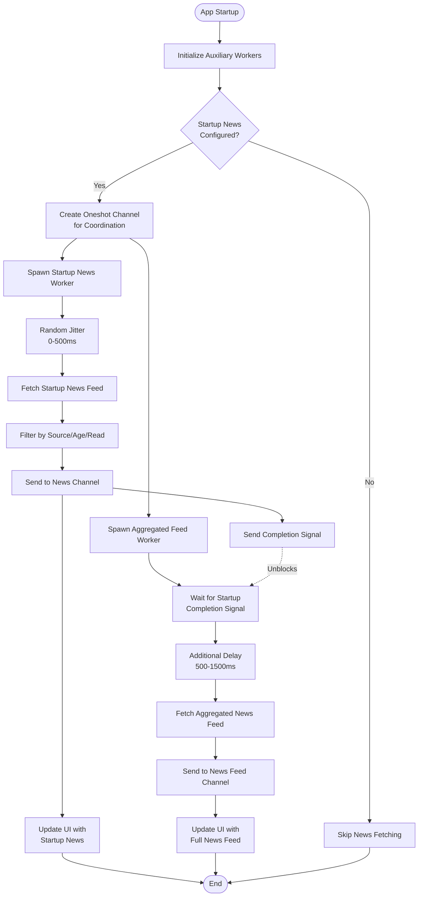

## Startup News Fetch Workflow

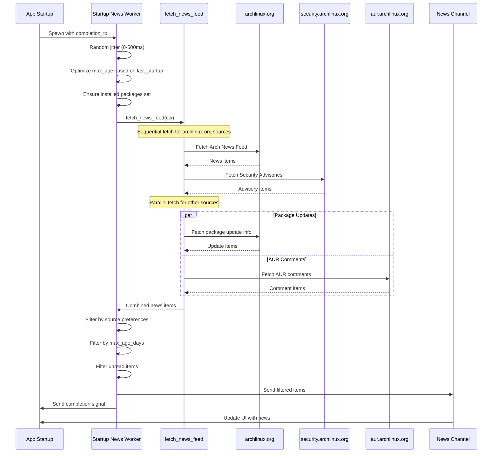

## Aggregated News Feed Fetch Workflow

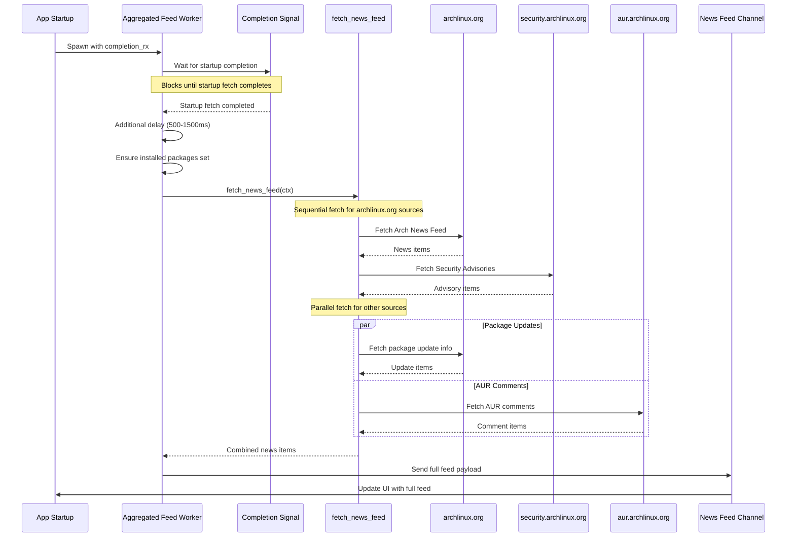

## News Content Fetching Workflow

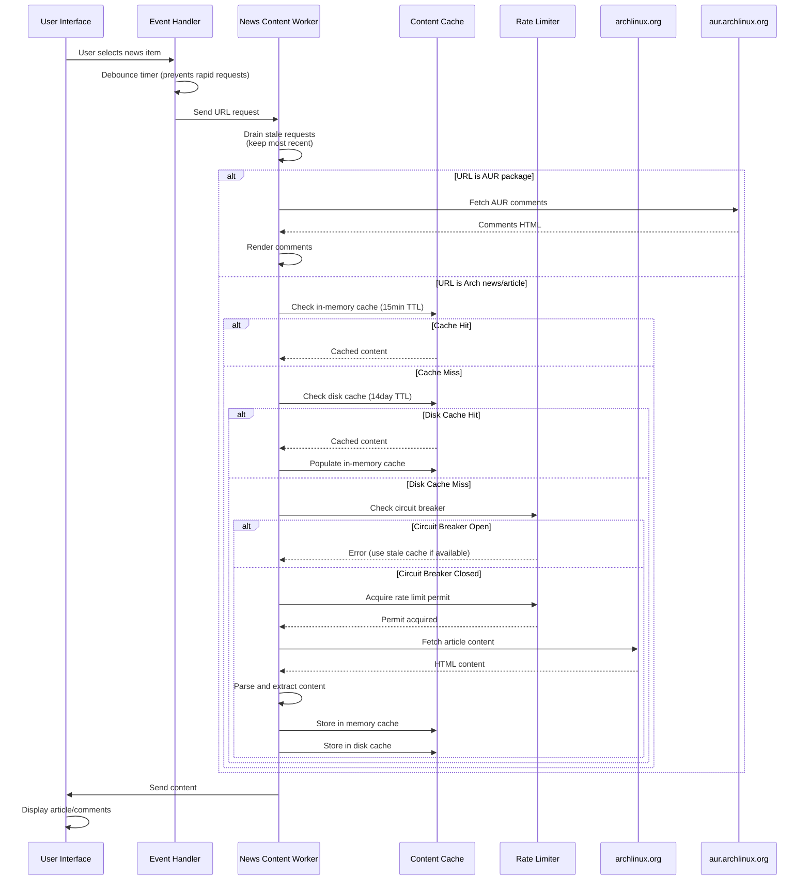

## Coordination Mechanism

The coordination between startup and aggregated news fetches prevents concurrent requests to `archlinux.org`:

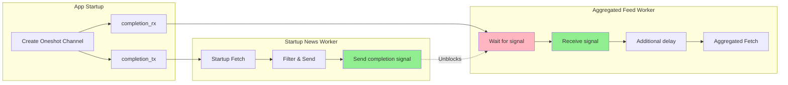

## Fetch Sources Details

### Arch News Fetch

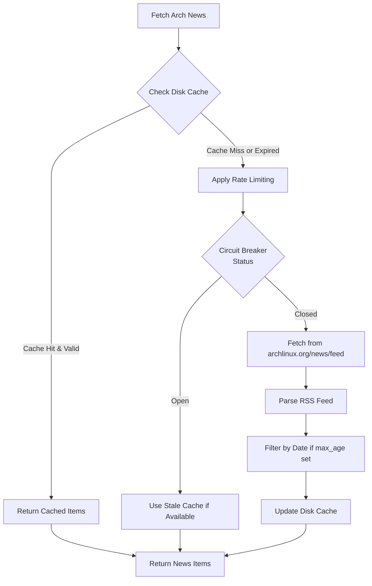

### Package Updates Fetch

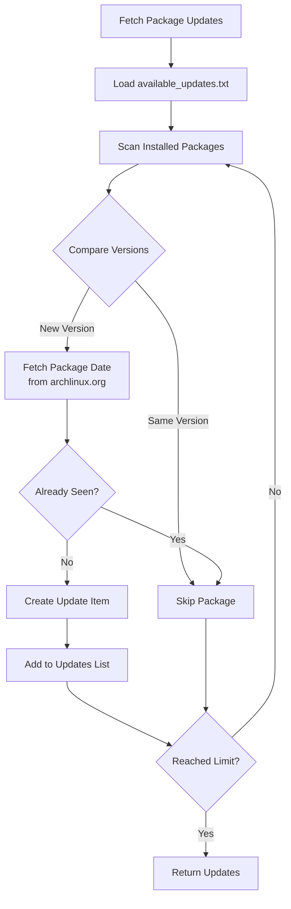

### AUR Comments Fetch

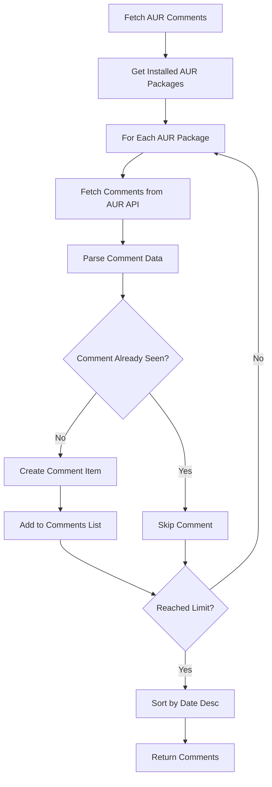

## Rate Limiting and Circuit Breaker

To prevent overwhelming `archlinux.org` and getting blocked:

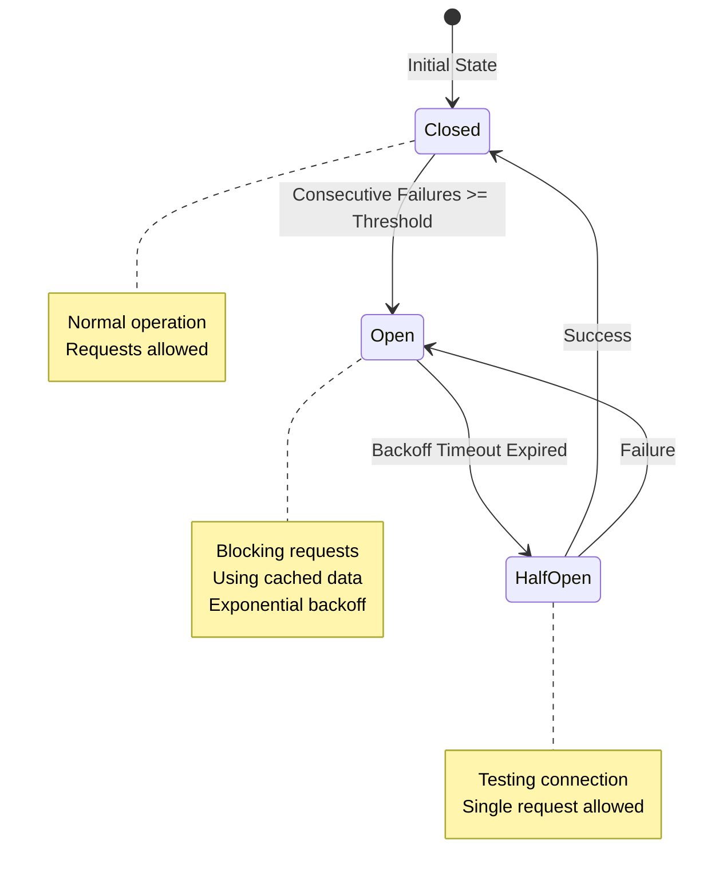

## Caching Strategy

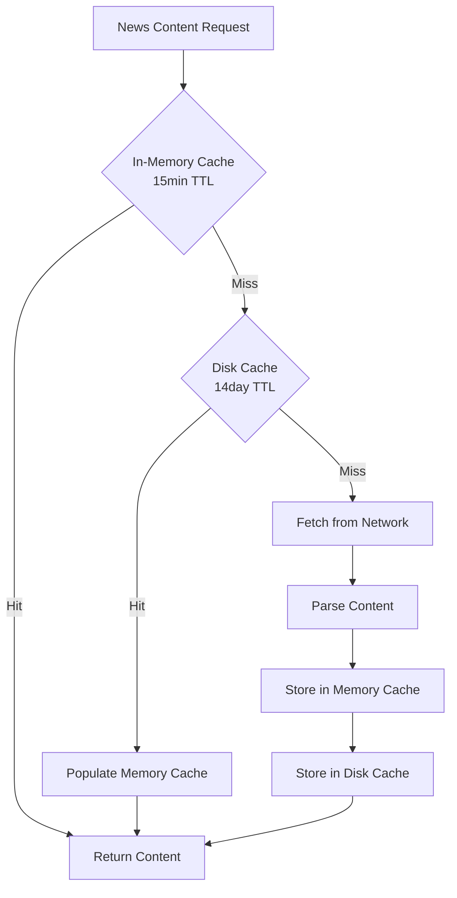

## Error Handling

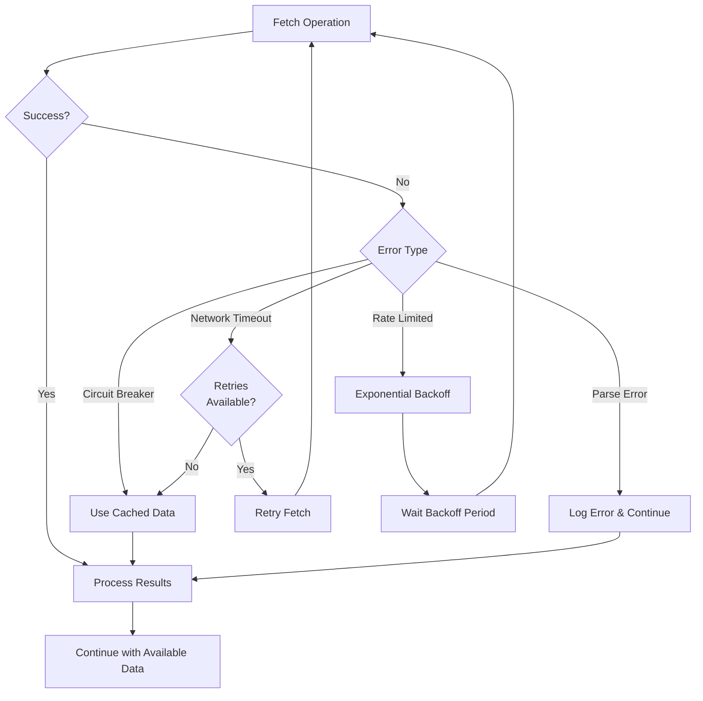

## Key Components

### Workers

1. **Startup News Worker** (`spawn_startup_news_worker`)
   - Fetches news on app startup
   - Uses startup news preferences
   - Filters by source, age, and read status
   - Sends completion signal when done

2. **Aggregated Feed Worker** (`spawn_aggregated_news_feed_worker`)
   - Fetches full news feed for main UI
   - Waits for startup fetch to complete
   - Always fetches all sources (arch news, advisories, updates, comments)

3. **News Content Worker** (`spawn_news_content_worker`)
   - Fetches individual article/package content on demand
   - Uses debouncing to prevent rapid requests
   - Implements caching (memory + disk)

### Coordination

- **Oneshot Channel**: Used to signal completion between startup and aggregated fetches
- **Random Delays**: Jitter prevents thundering herd problems
- **Rate Limiting**: Semaphore-based limiting for archlinux.org requests
- **Circuit Breaker**: Prevents repeated failures from overwhelming the server

### Data Flow

1. **Startup**: App initializes → Workers spawned → Startup fetch begins
2. **Coordination**: Startup fetch completes → Signal sent → Aggregated fetch unblocks
3. **Fetching**: Sources fetched sequentially (archlinux.org) or in parallel (others)
4. **Processing**: Items filtered, sorted, and deduplicated
5. **Delivery**: Items sent via channels to UI components
6. **Caching**: Successful fetches cached for future use

## Configuration

News fetching behavior is controlled by settings in `settings.conf`:

- `startup_news_show_arch_news`: Enable/disable Arch news in startup popup
- `startup_news_show_advisories`: Enable/disable security advisories
- `startup_news_show_pkg_updates`: Enable/disable package updates
- `startup_news_show_aur_comments`: Enable/disable AUR comments
- `startup_news_max_age_days`: Maximum age of news items to show
- `startup_news_configured`: Whether startup news is configured

## Performance Optimizations

1. **Caching**: Multi-level caching (memory + disk) reduces network requests
2. **Parallel Fetching**: Non-archlinux.org sources fetched in parallel
3. **Sequential Fetching**: archlinux.org sources fetched sequentially to prevent blocking
4. **Debouncing**: User interactions debounced to prevent rapid requests
5. **Request Draining**: Stale requests discarded, only most recent processed
6. **Incremental Updates**: Uses last startup timestamp to optimize fetch window
7. **Circuit Breaker**: Prevents cascading failures during outages

## Troubleshooting

### Issue: Getting blocked by archlinux.org

**Symptoms**: Timeout errors, rate limiting warnings

**Causes**:
- Concurrent requests to archlinux.org
- Too many requests in short time
- Network issues causing retries

**Solutions**:
- Ensure coordination mechanism is working (check logs for completion signals)
- Check circuit breaker status
- Verify rate limiting is active
- Review backoff delays

### Issue: News not updating

**Symptoms**: Old news items displayed, no new items

**Causes**:
- Cache not expiring
- Network failures
- Filter settings too restrictive

**Solutions**:
- Clear cache files
- Check network connectivity
- Review filter settings (max_age_days, source preferences)

### Issue: Slow news loading

**Symptoms**: Long delays before news appears

**Causes**:
- Network latency
- Large number of installed packages
- Rate limiting delays

**Solutions**:
- Check network connection
- Reduce number of sources enabled
- Review installed package count
- Check for circuit breaker backoff

